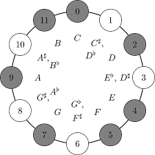

```{r setup, include=FALSE}
knitr::opts_chunk$set(echo = TRUE)
```

The research is under the S-STEM program and deals with trying to understand the symmetry in the 12-note western tonal system in its different frequency and octaves.  


[Brief Explanation](http://openmusictheory.com/mod12.html)'


It attempts to look for a generalized N-mod system outside of the standard 12, hence the microtonals. We're also looking into atonal systems as of this semester which deals in the use of all 12 notes rather than only portions of it in major/minor scales and the triads. 


[The Paper](https://mathr.math.appstate.edu/s/591df12bc58efdd713379/files/Version_Control_Folder/ongjk.github.io/Microtonal.pdf)


